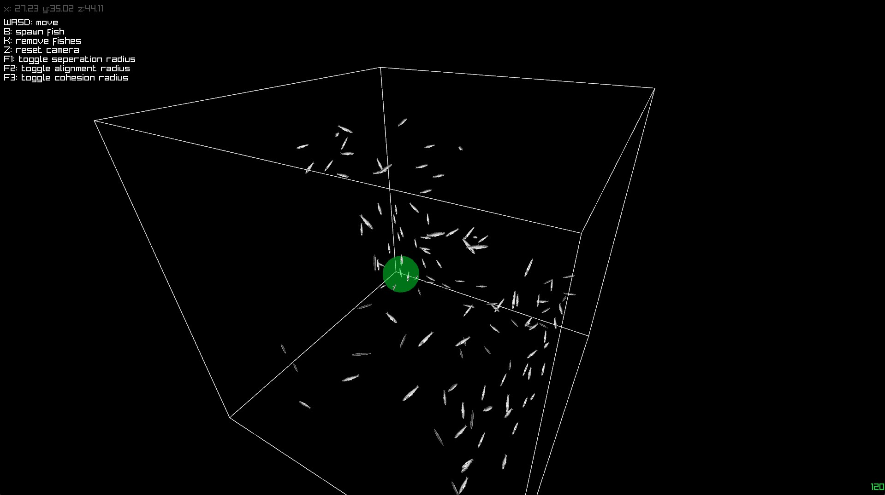

# Sardine Simulator
The Sardine Simulator is a program that simulates the flocking behavior of sardines. It utilizes an artificial life algorithm called [Boids](https://en.wikipedia.org/wiki/Boids). The simulation incorporates three simple rules: separation, alignment, and cohesion to mimic the movement of animals. Each rule can be fine-tuned by a factor to adjust the behavior of the simulation. Raylib is used to render the fishes in a 3D space, and a cube is drawn to represent the movement boundaries of the fishes.

## Control
WASD - movement
Mouse - move camera
B - spawn fish
K - remove fishes
Z - reset camera angle
F1 - toggle seperation radius
F2 - toggle alignment radius
F3 - toggle cohesion radius

## Requirement
- VisualStudio 2022
- MSVC

## Usage
Download and open solution in Visual Studio, build with x64 Debug mode and run Boids.cpp. Raylib is pre-instsalled in the dependencies.

## TODO
- add obstacle detection
- add skybox
- add lighting and shader
- optimize neighbor searching algorithm
- add UI to adjust factors